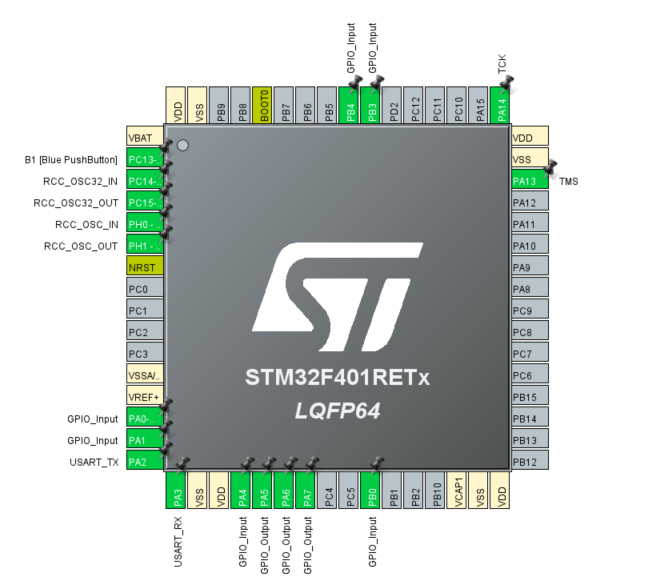

# STM32 Password-Protected Lock System

<p align="center">
  
</p>

An end-to-end embedded systems project covering firmware development, PCB design, hardware prototyping, and mechanical enclosure design.

## Overview

Designed and built a complete embedded password-protected lock system using an STM32 microcontroller. The project integrates embedded firmware, hardware prototyping, PCB design, and mechanical enclosure design into a fully functional device. The system was first validated on a breadboard before being transitioned to a custom PCB designed in Altium Designer and housed inside a custom enclosure designed in Fusion 360.

## Features

- 4-button password authentication system
- Password change mode with current password verification
- Three-attempt security lockout with cooldown timer
- LED indicators for system feedback
- Buzzer feedback for access status
- UART debugging through PuTTY
- Custom PCB designed in Altium Designer
- Custom enclosure designed in Fusion 360

## System Workflow

```text
                      Power On
                          │
                          ▼
              Is Change Password Button Pressed?
                    ┌───────────────┐
                Yes │               │ No
                    ▼               ▼
      Verify Current Password   Enter 4-Button Password
               │                        │
        Correct?                        ▼
         ┌────┴────┐           Firmware Reads Inputs
      Yes│         │No                  │
         ▼         ▼                    ▼
 Enter New Password   Return      Verify Password
         │                             │
         ▼                       ┌─────┴─────┐
 Password Updated            Correct      Incorrect
         │                     │              │
         ▼                     ▼              ▼
      System Ready     Access Granted    Attempts--
                                            │
                                            ▼
                                   3 Failed Attempts?
                                      ┌────┴────┐
                                   No │         │ Yes
                                      ▼         ▼
                                  Try Again   10 s Lockout
```

## Hardware

- STM32F401RE (NUCLEO-F401RE)
- Push Buttons
- LEDs
- Active Buzzer
- 2 220 Ohm Resistors
- 1 1k Ohm Resistor
- NPN Transistor
- UART Communication

## Software & Tools

- STM32CubeIDE
- STM32CubeMX
- Altium Designer
- Autodesk Fusion 360
- PuTTY

## STM32 Firmware & Pinout

The firmware was developed in Embedded C using STM32CubeIDE, with STM32CubeMX used to configure the microcontroller pinout and generate initialization code.

### Pinout Configuration

<p align="center">
  
</p>

| Function | STM32 Pin | Purpose |
|---|---|---|
| Button 1 | PA0 | Password input |
| Button 2 | PA1 | Password input |
| Button 3 | PA4 | Password input |
| Button 4 | PB3 | Password input |
| Change Password Button | PB4 | Enters password change mode |
| Green LED | PA5 | Access granted/status feedback |
| Red LED | PA6 | Access denied/lockout feedback |
| Buzzer | PA7 | Audible feedback |
| UART TX | PA2 | Serial debugging through PuTTY |
| UART RX | PA3 | Serial debugging through PuTTY |

### Firmware Functionality

- Reads push-button inputs and stores them as a 4-button password sequence.
- Compares the entered sequence against the saved password.
- Provides LED and buzzer feedback for access granted and access denied states.
- Includes a password change mode that requires the current password before updating.
- Implements a three-attempt lockout with a cooldown timer.
- Uses UART communication with PuTTY to display system messages and debugging output.

The complete firmware source code and STM32CubeMX configuration are included in the `Firmware` folder.

### UART Debugging (PuTTY)

PuTTY was used as a serial terminal to monitor the STM32 firmware during development and debugging. The microcontroller communicated with the PC over a UART interface through the ST-Link virtual COM port (COM5) configured at 115200 baud, 8 data bits, no parity, 1 stop bit (8N1), and no flow control. Real-time serial output was used to verify button inputs, password authentication, remaining login attempts, password change operations, and overall system behavior without requiring additional debugging hardware.

## Project Gallery

| Breadboard Prototype | Altium Schematic |
|---|---|
|  |  |

| PCB Layout | PCB 3D View |
|---|---|
|  |  |

| Fusion Exploded View | Fusion Final Assembly |
|---|---|
|  |  |

## Lessons Learned

Through this project, I gained hands-on experience with:

- Embedded firmware development using STM32CubeIDE and STM32CubeMX.
- Designing, debugging, and validating circuits through breadboard prototyping.
- Creating professional schematics and PCB layouts in Altium Designer.
- Integrating electrical and mechanical designs into a complete embedded system.
- Designing a custom 3D-printable enclosure with manufacturing considerations such as mounting features, clearances, and assembly.
- Using UART communication to simplify firmware debugging and system testing.
